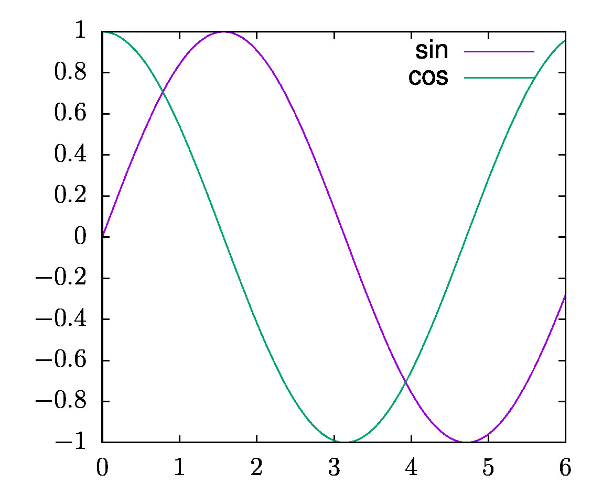

# autogpy - AutoGnuplot.py
Automatic generation of gnuplot figures (including script and data) from python


## In a nutshell

### Installation

```bash
git clone git@github.com:acorbe/autogpy.git
pip install ./autogpy
```

### Usage

```python
import autogpy
import numpy as np

xx = np.linspace(0,6,100)
yy = np.sin(xx)
zz = np.cos(xx)

figure = autogpy.AutogpyFigure("test_figure","test1")

figure.p_generic(r'u 1:2 with lines t "sin"',xx,yy)
figure.p_generic(r'u 1:2 with lines t "cos"',xx,zz)
figure.generate_gnuplot_file()

figure.jupyter_show_pdflatex() # only in jupyter

```


will generate the following figure




and, most importantly, the following source and data in `test_figure`

```bash
Makefile
sync_me.sh
test1__0__.dat
test1__1__.dat
test1__.core.gnu
test1__.jpg.gnu
test1__.pdflatex_compile.sh
test1__.pdflatex.gnu
test1__.tikz_compile.sh
test1__.tikz.gnu
```

With `make` one can obtain jpg, epslatex, and tikz/pgfplot version of the figure. The data has been formatted automatically.

Inspecting `test1__.pdflatex.gnu`, responsible of the epslatex version of the figure, one gets:
```gnuplot
set terminal epslatex size 9.9cm,8.cm color colortext standalone      'phv,12 '  linewidth 2
set output 'fig.latex.nice/plot_out.tex'

load "test1__.core.gnu"; 
```
while `test1__.core.gnu` reads:
```gnuplot
p "test1__0__.dat" u 1:2 with lines t "sin",\
"test1__1__.dat" u 1:2 with lines t "cos"

```


